# DNSSEC Validator

[](https://hub.docker.com/r/maboni82/dnssec-validator)
[](https://hub.docker.com/r/maboni82/dnssec-validator)
[](https://github.com/BondIT-ApS/dnssec-validator/actions)
[](https://github.com/BondIT-ApS/dnssec-validator/issues)
[](https://github.com/BondIT-ApS/dnssec-validator/stargazers)
[](https://github.com/BondIT-ApS/dnssec-validator/blob/master/LICENSE)
[](https://github.com/BondIT-ApS/dnssec-validator/security)

A **professional-grade** web-based DNSSEC validation tool that provides comprehensive analysis of DNS Security Extensions (DNSSEC) for any domain. This tool validates the complete chain of trust from root servers down to your domain, similar to Verisign's DNSSEC Debugger but with modern architecture and enhanced features.

## 🚀 Features

- **Complete Chain of Trust Validation**: Traces DNSSEC validation from root (.) → TLD → domain
- **Real-time Analysis**: Live DNS queries with detailed step-by-step validation
- **Visual Interface**: Clean web UI showing validation results with color-coded status
- **API Endpoint**: RESTful API for programmatic access
- **Docker Support**: Easy deployment with Docker containers
- **Multi-Algorithm Support**: Supports all DNSSEC algorithms (RSA, ECDSA, EdDSA)
- **Detailed Reporting**: Shows DNSKEY, DS, RRSIG records with validation status

## 🌐 Live Demo

🎉 **Try the live version at: [https://dnssec-validator.bondit.dk](https://dnssec-validator.bondit.dk)**

The production deployment includes:
- ✅ HTTPS with SSL/TLS encryption
- ✅ Professional domain and hosting
- ✅ High availability and monitoring
- ✅ Full API documentation at `/api/docs/`

## 🐳 Quick Start with Docker

```bash
# Run the container
docker run -p 8080:8080 maboni82/dnssec-validator:latest

# Open your browser to http://localhost:8080
```

## 🔧 Manual Installation

### Prerequisites

- Python 3.8+
- pip

### Installation

```bash
git clone https://github.com/BondIT-ApS/dnssec-validator.git
cd dnssec-validator
pip install -r requirements.txt
python app.py
```

Open your browser to `http://localhost:8080`

## 📖 Usage

### Web Interface

1. Navigate to the web interface
2. Enter a domain name (e.g., `bondit.dk`)
3. Click "Validate DNSSEC"
4. View the detailed validation report

### API Usage

```bash
# Validate a domain via API
curl "http://localhost:8080/api/validate/bondit.dk"

# Response format
{
  "domain": "bondit.dk",
  "status": "valid",
  "chain_of_trust": [
    {
      "zone": ".",
      "status": "valid",
      "algorithm": 8,
      "key_tag": 20326
    },
    {
      "zone": "dk.",
      "status": "valid", 
      "algorithm": 13,
      "key_tag": 20109
    },
    {
      "zone": "bondit.dk.",
      "status": "valid",
      "algorithm": 13,
      "key_tag": 48993
    }
  ],
  "records": {
    "dnskey": [...],
    "ds": [...],
    "rrsig": [...]
  }
}
```

## 🏗️ Architecture

```mermaid
graph TB
    subgraph "User Interface"
        WEB["🌐 Web Frontend<br/>(HTML/CSS/JS)"]
        API["🔌 REST API<br/>(/api/validate)"]
    end
    
    subgraph "Application Layer"
        FLASK["🐍 Flask App<br/>(Python)"]
        ENGINE["🔒 DNSSEC Engine<br/>(dnspython)"]
    end
    
    subgraph "External Services"
        DNS["🌍 DNS Servers<br/>(Root, TLD, Authoritative)"]
        VALIDATION["✅ DNSSEC Validation<br/>(Chain of Trust)"]
    end
    
    WEB --> FLASK
    API --> FLASK
    FLASK --> ENGINE
    ENGINE --> DNS
    ENGINE --> VALIDATION
    
    style WEB fill:#e1f5fe
    style API fill:#e8f5e8
    style FLASK fill:#fff3e0
    style ENGINE fill:#fce4ec
    style DNS fill:#f3e5f5
    style VALIDATION fill:#e0f2f1
```



## 🔍 What It Validates

- **Root Trust Anchor**: Validates against IANA root trust anchors
- **DS Records**: Checks Delegation Signer records in parent zones
- **DNSKEY Records**: Validates public keys and algorithms
- **RRSIG Records**: Verifies cryptographic signatures
- **Chain Continuity**: Ensures unbroken chain from root to domain
- **Algorithm Support**: Validates RSA/SHA-1, RSA/SHA-256, ECDSA P-256, ECDSA P-384, Ed25519

## 📂 Project Structure

```
dnssec-validator/
├── app.py                 # Flask web application
├── dnssec_validator.py    # Core DNSSEC validation logic
├── static/
│   ├── css/
│   │   └── style.css     # Web interface styling
│   └── js/
│       └── app.js        # Frontend JavaScript
├── templates/
│   └── index.html        # Main web interface
├── requirements.txt       # Python dependencies
├── Dockerfile            # Docker container definition
├── docker-compose.yml    # Docker Compose setup
└── README.md            # This file
```

## 🧪 Development

### Running Tests

```bash
python -m pytest tests/
```

### Development Mode

```bash
export FLASK_ENV=development
python app.py
```

## 🚀 Deployment

### Docker

```bash
# Build the image
docker build -t dnssec-validator .

# Run the container
docker run -p 8080:8080 dnssec-validator
```

### Docker Compose

```bash
docker-compose up -d
```

### Cloud Deployment

The application can be deployed to:
- **Heroku**: `heroku create your-app-name`
- **Google Cloud Run**: `gcloud run deploy`
- **AWS ECS**: Using the provided Dockerfile
- **Kubernetes**: Using the provided manifests

## 🤝 Contributing

We welcome contributions! Please see our [Contributing Guidelines](CONTRIBUTING.md) for details.

### Development Setup

1. Fork the repository
2. Create a feature branch: `git checkout -b feature-name`
3. Make your changes
4. Add tests for new functionality
5. Run tests: `python -m pytest`
6. Submit a pull request

## 📋 Todo / Roadmap

- [ ] Add support for CAA record validation (#35)
- [ ] Implement TLSA record checking (#34)
- [ ] Create batch validation API (#32)
- [ ] Add database for request logging and monitoring (#33)
- [ ] Implement caching for faster responses (#36)
- [ ] Add support for internationalized domain names (IDN) (#37)

## ⚠️ Security Considerations

- This tool performs live DNS queries to validate DNSSEC
- No domain data is stored or logged
- All validation is performed server-side
- Rate limiting is implemented to prevent abuse

## 📄 License

This project is licensed under the MIT License - see the [LICENSE](LICENSE) file for details.

## 🙋‍♂️ Support

- **Issues**: Report bugs and request features via [GitHub Issues](https://github.com/BondIT-ApS/dnssec-validator/issues)
- **Documentation**: Full API documentation available at `/docs` when running
- **Community**: Join our discussions in [GitHub Discussions](https://github.com/BondIT-ApS/dnssec-validator/discussions)

## 🏢 About BondIT ApS

This project is maintained and developed by [BondIT ApS](https://bondit.dk), a Scandinavian IT Consultancy Company, which loves to build software one brick at a time and create fantastic secure web applications and infrastructure tools.

---

**Made with ❤️ by BondIT ApS**
