# DNSSEC Validator

[](https://github.com/BondIT-ApS/dnssec-validator/releases/latest)
[](https://github.com/BondIT-ApS/dnssec-validator/releases)
[](https://hub.docker.com/r/maboni82/dnssec-validator)
[](https://github.com/BondIT-ApS/dnssec-validator/actions)
[](https://github.com/BondIT-ApS/dnssec-validator/issues)
[](https://github.com/BondIT-ApS/dnssec-validator/stargazers)
[](https://github.com/BondIT-ApS/dnssec-validator/blob/master/LICENSE)
[](https://github.com/BondIT-ApS/dnssec-validator/security)

A **professional-grade** web-based DNSSEC validation tool that provides comprehensive analysis of DNS Security Extensions (DNSSEC) for any domain. This tool validates the complete chain of trust from root servers down to your domain, similar to Verisign's DNSSEC Debugger but with modern architecture and enhanced features.

## 🚀 Features

- **Complete Chain of Trust Validation**: Traces DNSSEC validation from root (.) → TLD → domain
- **Real-time Analysis**: Live DNS queries with detailed step-by-step validation
- **Visual Interface**: Clean web UI showing validation results with color-coded status
- **Smart Input Processing**: Accepts both domain names and full URLs (automatically extracts domains)
- **API Endpoint**: RESTful API for programmatic access
- **Docker Support**: Easy deployment with Docker containers
- **Multi-Algorithm Support**: Supports all DNSSEC algorithms (RSA, ECDSA, EdDSA)
- **Detailed Reporting**: Shows DNSKEY, DS, RRSIG records with validation status

## 🌐 Live Demo

🎉 **Try the live version at: [https://dnssec-validator.bondit.dk](https://dnssec-validator.bondit.dk)**

The production deployment includes:
- ✅ HTTPS with SSL/TLS encryption
- ✅ Professional domain and hosting
- ✅ High availability and monitoring
- ✅ Full API documentation at `/api/docs/`

## 🐳 Quick Start with Docker

```bash
# Run the container
docker run -p 8080:8080 maboni82/dnssec-validator:latest

# Open your browser to http://localhost:8080
```

## 🔧 Manual Installation

### Prerequisites

- Python 3.13+ (recommended for latest security features)
- pip

### Installation

```bash
git clone https://github.com/BondIT-ApS/dnssec-validator.git
cd dnssec-validator
pip install -r requirements.txt
python app.py
```

Open your browser to `http://localhost:8080`

## 📖 Usage

### Web Interface

1. Navigate to the web interface
2. Enter a domain name or URL (e.g., `bondit.dk` or `https://bondit.dk/path`)
3. Click "Validate DNSSEC"
4. View the detailed validation report

**Supported Input Formats:**
- Plain domains: `bondit.dk`, `api.example.com`
- URLs: `https://bondit.dk`, `http://example.com/path`
- URLs are automatically parsed to extract the domain name
- `www.` prefixes are automatically removed

### API Usage

#### DNSSEC Validation

```bash
# Validate a domain via API
curl "http://localhost:8080/api/validate/bondit.dk"

# Or validate using a URL (automatically extracts domain)
curl "http://localhost:8080/api/validate/https://bondit.dk/path"

# Response format
{
  "domain": "bondit.dk",
  "status": "valid",
  "validation_time": "2025-08-08T16:30:00Z",
  "chain_of_trust": [
    {
      "zone": ".",
      "status": "valid",
      "algorithm": 8,
      "key_tag": 20326
    },
    {
      "zone": "dk.",
      "status": "valid", 
      "algorithm": 13,
      "key_tag": 20109
    },
    {
      "zone": "bondit.dk.",
      "status": "valid",
      "algorithm": 13,
      "key_tag": 48993
    }
  ],
  "records": {
    "dnskey": [{
      "zone": "bondit.dk.",
      "flags": 256,
      "protocol": 3,
      "algorithm": 13,
      "key_tag": 48993
    }],
    "ds": [{
      "zone": "dk.",
      "key_tag": 48993,
      "algorithm": 13,
      "digest_type": 2
    }],
    "rrsig": [{
      "type_covered": "DNSKEY",
      "algorithm": 13,
      "labels": 2,
      "original_ttl": 3600,
      "expiration": 1723104000,
      "inception": 1722499200,
      "key_tag": 48993,
      "signer": "bondit.dk."
    }]
  },
  "tlsa_summary": {
    "status": "valid",
    "records_found": 2,
    "dane_status": "valid",
    "message": "TLSA records are correctly configured"
  },
  "errors": []
}
```

#### Health Check Endpoints

The application provides dedicated health check endpoints for monitoring and container orchestration:

```bash
# Detailed health check (JSON response)
curl "http://localhost:8080/health"

# Response format
{
  "status": "healthy",
  "timestamp": "2025-08-06T07:23:12Z",
  "version": "1.0.0",
  "checks": {
    "application": "ok",
    "dns_resolver": "ok",
    "memory_usage": "ok"
  },
  "uptime": "2h 15m 32s"
}

# Simple health check (plain text response)
curl "http://localhost:8080/health/simple"
# Response: "healthy"
```

**Health Status Levels:**
- `healthy`: All systems operational (HTTP 200)
- `degraded`: Some non-critical issues detected (HTTP 200) 
- `unhealthy`: Critical issues affecting functionality (HTTP 503)

## 🏗️ Architecture

```mermaid
graph TB
    subgraph "User Interface"
        WEB["🌐 Web Frontend<br/>(HTML/CSS/JS)"]
        API["🔌 REST API<br/>(/api/validate)"]
    end
    
    subgraph "Application Layer"
        FLASK["🐍 Flask App<br/>(Python)"]
        ENGINE["🔒 DNSSEC Engine<br/>(dnspython)"]
    end
    
    subgraph "External Services"
        DNS["🌍 DNS Servers<br/>(Root, TLD, Authoritative)"]
        VALIDATION["✅ DNSSEC Validation<br/>(Chain of Trust)"]
    end
    
    WEB --> FLASK
    API --> FLASK
    FLASK --> ENGINE
    ENGINE --> DNS
    ENGINE --> VALIDATION
    
    style WEB fill:#e1f5fe
    style API fill:#e8f5e8
    style FLASK fill:#fff3e0
    style ENGINE fill:#fce4ec
    style DNS fill:#f3e5f5
    style VALIDATION fill:#e0f2f1
```



## 🔍 What It Validates

- **Root Trust Anchor**: Validates against IANA root trust anchors
- **DS Records**: Checks Delegation Signer records in parent zones
- **DNSKEY Records**: Validates public keys and algorithms
- **RRSIG Records**: Verifies cryptographic signatures
- **Chain Continuity**: Ensures unbroken chain from root to domain
- **Algorithm Support**: Validates RSA/SHA-1, RSA/SHA-256, ECDSA P-256, ECDSA P-384, Ed25519

## 📊 Database Logging & Analytics

The DNSSEC Validator now includes comprehensive request logging and analytics using **InfluxDB**, a time-series database optimized for monitoring and analytics.

### InfluxDB Integration

All DNSSEC validation requests are automatically logged to InfluxDB with detailed metadata:

- **Domain validation requests** with timestamps
- **IP address tracking** for usage analytics  
- **DNSSEC validation status** (valid/invalid/error)
- **Request source tracking** (API vs web interface)
- **HTTP status codes** and user agent information
- **90-day data retention** with automatic cleanup

### Configuration

Database logging is configured via environment variables:

```bash
# Enable/disable request logging
REQUEST_LOGGING_ENABLED=true

# InfluxDB connection settings
INFLUX_URL=http://influxdb:8086
INFLUX_TOKEN=my-super-secret-auth-token
INFLUX_ORG=dnssec-validator
INFLUX_BUCKET=requests
```

### Analytics Capabilities

The logging system provides built-in analytics methods for monitoring:

- **Request count tracking** by time period (hours/days)
- **Top domains analysis** with request frequencies
- **Validation success/failure ratios** for quality monitoring
- **API vs web interface usage breakdown**
- **Hourly request patterns** for trend analysis
- **IP-based usage analytics** for rate limiting insights

### Docker Compose Integration

The database logging works seamlessly with Docker Compose. We provide two configurations:

**Development (docker-compose.yml):**
```yaml
services:
  influxdb:
    image: influxdb:2.7-alpine
    container_name: dnssec-influxdb
    ports:
      - "8086:8086"
    environment:
      - DOCKER_INFLUXDB_INIT_MODE=setup
      - DOCKER_INFLUXDB_INIT_USERNAME=admin
      - DOCKER_INFLUXDB_INIT_PASSWORD=adminpassword
      - DOCKER_INFLUXDB_INIT_ORG=dnssec-validator
      - DOCKER_INFLUXDB_INIT_BUCKET=requests
      - DOCKER_INFLUXDB_INIT_RETENTION=10d  # Short retention for dev
      - DOCKER_INFLUXDB_INIT_ADMIN_TOKEN=my-super-secret-auth-token
    volumes:
      - influx_data:/var/lib/influxdb2
    healthcheck:
      test: ["CMD", "influx", "ping"]
      interval: 30s
      timeout: 10s
      retries: 3

  dnssec-validator:
    build: .
    ports:
      - "8080:8080"
    environment:
      - FLASK_ENV=development
      - REQUEST_LOGGING_ENABLED=true
      - INFLUX_URL=http://influxdb:8086
      - INFLUX_TOKEN=my-super-secret-auth-token
      - INFLUX_ORG=dnssec-validator
      - INFLUX_BUCKET=requests
      # Rate limiting and health check configuration
      - RATE_LIMIT_GLOBAL_DAY=5000
      - HEALTH_CHECK_ENABLED=true
      - SHOW_VALIDATION_TLSA_DANE=false  # Feature flag for TLSA validation display
    volumes:
      - ./app:/app
    depends_on:
      - influxdb
    healthcheck:
      test: ["CMD", "curl", "-f", "http://localhost:8080/health/simple"]
      interval: 30s
      timeout: 10s
      retries: 3
```

**Production (docker-compose.prod.yml):**
```yaml
services:
  influxdb:
    image: influxdb:2.7-alpine
    container_name: dnssec-influxdb-prod
    ports:
      - "8088:8086"  # Different port for production
    environment:
      - DOCKER_INFLUXDB_INIT_RETENTION=30d  # Longer retention for production
      - DOCKER_INFLUXDB_INIT_ADMIN_TOKEN=production-super-secret-auth-token
    networks:
      - dnssec-network

  dnssec-validator:
    image: maboni82/dnssec-validator:latest  # Uses published image
    container_name: dnssec-validator-prod
    ports:
      - "8091:8080"
    environment:
      - FLASK_ENV=production
      - LOG_LEVEL=INFO
      - LOG_FORMAT=json  # Structured logging for production
      - CORS_ORIGINS=https://dnssec-validator.bondit.dk
      - HEALTH_CHECK_MEMORY_THRESHOLD=80
    networks:
      - dnssec-network
```

### Data Structure

The InfluxDB measurement structure:

- **Organization**: `dnssec-validator`
- **Bucket**: `requests` (90-day retention)
- **Measurement**: `request`
- **Tags**: `domain`, `ip_address`, `dnssec_status`, `source`
- **Fields**: `count`, `http_status`, `user_agent`
- **Timestamp**: Automatic with nanosecond precision

### Analytics Foundation

This logging system creates the foundation for:
- **Real-time monitoring dashboards** (future enhancement)
- **Usage trend analysis** and capacity planning  
- **Domain validation success rate monitoring**
- **Performance optimization** based on request patterns
- **Rate limiting refinement** using actual usage data

## 📂 Project Structure

```
dnssec-validator/
├── .github/
│   └── workflows/       # GitHub Actions for automated builds
│       ├── docker-publish.yml  # Official releases (triggered by version tags)
│       ├── nightly.yml         # Daily development builds
│       ├── monthly.yml         # Monthly official releases
│       └── test-build.yml      # Manual testing workflow
├── app/
│   ├── app.py            # Main Flask web application with API
│   ├── models.py         # InfluxDB logging and analytics
│   ├── cli.py            # Command-line management tools
│   ├── db_init.py        # Database initialization utilities
│   ├── dnssec_validator.py  # Core DNSSEC validation logic
│   ├── tlsa_validator.py    # TLSA/DANE validation implementation
│   ├── static/
│   │   ├── css/
│   │   │   └── style.css    # Web interface styling
│   │   └── js/
│   │       └── app.js       # Frontend JavaScript
│   └── templates/
│       ├── index.html       # Main web interface
│       ├── detailed.html    # Detailed validation results
│       ├── stats.html       # Analytics dashboard
│       └── rate_limit.html  # Rate limiting error page
├── requirements.txt      # Python dependencies
├── Dockerfile           # Docker container definition
├── docker-compose.yml   # Development Docker Compose setup
├── docker-compose.prod.yml  # Production Docker Compose setup
├── CONTRIBUTING.md      # Contributing guidelines
└── README.md           # This file
```

## 🧪 Development

### Running Tests

```bash
python -m pytest tests/
```

### Development Mode

```bash
export FLASK_ENV=development
python app.py
```

## 🚀 Deployment

### Docker

```bash
# Build the image
docker build -t dnssec-validator .

# Run the container
docker run -p 8080:8080 dnssec-validator
```

### Docker Compose

```bash
docker-compose up -d
```


## 🤝 Contributing

We welcome contributions! Please see our [Contributing Guidelines](CONTRIBUTING.md) for details.

### Development Setup

1. Fork the repository
2. Create a feature branch: `git checkout -b feature-name`
3. Make your changes
4. Add tests for new functionality
5. Run tests: `python -m pytest`
6. Submit a pull request

## 📋 Todo / Roadmap

- [ ] [Add support for CAA record validation](https://github.com/BondIT-ApS/dnssec-validator/issues/35)
- [x] [Implement TLSA record checking](https://github.com/BondIT-ApS/dnssec-validator/issues/34) ✅ **Completed** - Full TLSA/DANE validation with certificate verification
- [ ] [Create batch validation API](https://github.com/BondIT-ApS/dnssec-validator/issues/32)
- [x] [Add database for request logging and monitoring](https://github.com/BondIT-ApS/dnssec-validator/issues/33) ✅ **Completed** - InfluxDB integration with comprehensive analytics
- [ ] [Implement caching for faster responses](https://github.com/BondIT-ApS/dnssec-validator/issues/36)
- [ ] [Add support for internationalized domain names (IDN)](https://github.com/BondIT-ApS/dnssec-validator/issues/37)

## 🛡️ Rate Limiting

The DNSSEC Validator includes comprehensive rate limiting to ensure fair usage and prevent abuse. Rate limits are applied per IP address and are configurable via environment variables.

### Default Rate Limits

| Endpoint Type | Limit | Description |
|---------------|-------|-------------|
| **Global** | 5000/day, 1000/hour | Overall requests per IP across all endpoints |
| **API** | 200/minute, 2000/hour | REST API endpoints (`/api/validate/*`) |
| **Web Interface** | 50/minute, 500/hour | Web UI and direct domain URLs |

### Configuration

Rate limits can be customized using environment variables:

```bash
# Global rate limits (applied to all requests)
RATE_LIMIT_GLOBAL_DAY=5000    # Requests per IP per day
RATE_LIMIT_GLOBAL_HOUR=1000   # Requests per IP per hour

# API-specific rate limits
RATE_LIMIT_API_MINUTE=200     # API requests per IP per minute
RATE_LIMIT_API_HOUR=2000      # API requests per IP per hour

# Web interface rate limits
RATE_LIMIT_WEB_MINUTE=50      # Web requests per IP per minute
RATE_LIMIT_WEB_HOUR=500       # Web requests per IP per hour
```

### Docker Compose Example

```yaml
services:
  dnssec-validator:
    build: .
    ports:
      - "8080:8080"
    environment:
      - FLASK_ENV=production
      # Custom rate limits for high-traffic deployment
      - RATE_LIMIT_GLOBAL_DAY=500
      - RATE_LIMIT_GLOBAL_HOUR=100
      - RATE_LIMIT_API_MINUTE=15
      - RATE_LIMIT_API_HOUR=150
      - RATE_LIMIT_WEB_MINUTE=30
      - RATE_LIMIT_WEB_HOUR=300
```

### Rate Limit Responses

When rate limits are exceeded:

**API Endpoints** return structured JSON:
```json
{
  "error": {
    "code": "RATE_LIMIT_EXCEEDED",
    "message": "API rate limit exceeded",
    "details": {
      "limit": "10 per 1 minute",
      "retry_after": 45,
      "reset_time": "2024-01-15T14:30:00Z"
    }
  }
}
```

**Web Interface** shows a user-friendly error page with:
- Current rate limit information
- Time until limit resets
- Suggestions for API usage for automated tools

### Production Recommendations

For production deployments:

```bash
# Conservative limits for public services
RATE_LIMIT_GLOBAL_DAY=1000
RATE_LIMIT_GLOBAL_HOUR=100
RATE_LIMIT_API_MINUTE=5
RATE_LIMIT_API_HOUR=50
RATE_LIMIT_WEB_MINUTE=10
RATE_LIMIT_WEB_HOUR=100

# More generous limits for internal/enterprise use
RATE_LIMIT_GLOBAL_DAY=5000
RATE_LIMIT_GLOBAL_HOUR=500
RATE_LIMIT_API_MINUTE=30
RATE_LIMIT_API_HOUR=1000
RATE_LIMIT_WEB_MINUTE=50
RATE_LIMIT_WEB_HOUR=1000
```

## 🏥 Health Monitoring

The DNSSEC Validator includes comprehensive health monitoring capabilities designed for container orchestration and monitoring systems.

### Health Check Endpoints

| Endpoint | Purpose | Response Format | Rate Limited |
|----------|---------|-----------------|-------------|
| `/health` | Detailed health status | JSON | No |
| `/health/simple` | Basic health check | Plain text | No |

### Health Check Configuration

Health monitoring behavior can be customized using environment variables:

```bash
# Health check configuration
HEALTH_CHECK_ENABLED=true          # Enable/disable detailed health checks
HEALTH_CHECK_DNS_TEST=true         # Test DNS resolution capability
HEALTH_CHECK_MEMORY_THRESHOLD=90   # Memory usage warning threshold (%)
```

### Docker Health Check Integration

Both Docker Compose configurations include health checks:

**Development (docker-compose.yml):**
```yaml
healthcheck:
  test: ["CMD", "python3", "-c", "import urllib.request; urllib.request.urlopen('http://localhost:8080/health/simple')"]
  interval: 30s
  timeout: 10s
  retries: 3
  start_period: 60s
```

**Production (docker-compose.prod.yml):**
```yaml
healthcheck:
  test: ["CMD", "python3", "-c", "import urllib.request; urllib.request.urlopen('http://localhost:8080/health/simple')"]
  interval: 30s
  timeout: 10s
  retries: 3
  start_period: 60s
```

### Health Check Components

The detailed health endpoint (`/health`) monitors:

1. **Application Status**: Basic Flask app responsiveness
2. **DNS Resolver**: Tests ability to resolve DNS queries (`example.com`)
3. **Memory Usage**: Monitors system memory consumption
4. **Uptime**: Tracks application runtime since startup

### Container Orchestration Benefits

- **Portainer**: Visual health status indicators in container overview
- **Docker Swarm**: Automatic container replacement on health failures
- **Kubernetes**: Readiness and liveness probe compatibility
- **Load Balancers**: Health-based traffic routing decisions
- **Monitoring Tools**: Integration with Prometheus, Grafana, etc.

### Monitoring Integration Examples

**Prometheus scraping configuration:**
```yaml
scrape_configs:
  - job_name: 'dnssec-validator'
    static_configs:
      - targets: ['localhost:8080']
    metrics_path: '/health'
    scrape_interval: 30s
```

**Kubernetes liveness probe:**
```yaml
livenessProbe:
  httpGet:
    path: /health/simple
    port: 8080
  initialDelaySeconds: 60
  periodSeconds: 30
  timeoutSeconds: 10
  failureThreshold: 3
```

## ⚠️ Security Considerations

- This tool performs live DNS queries to validate DNSSEC
- **Domain request data is logged** for analytics purposes with configurable retention periods (10-30 days)
- **Personal data**: Only IP addresses and domains are stored, no personal information
- **Data retention**: Configurable via `INFLUX_DB_RETENTION` environment variable
- **Data protection**: All stored data is automatically purged after retention period expires
- All validation is performed server-side for security
- Comprehensive rate limiting prevents abuse and ensures fair usage
- Security headers (CSP, HSTS) protect against common web vulnerabilities
- CORS configuration restricts cross-origin requests in production
- API requests are logged for monitoring and analytics (can be disabled via `REQUEST_LOGGING_ENABLED=false`)

## 📄 License

This project is licensed under the MIT License - see the [LICENSE](LICENSE) file for details.

## 🙋‍♂️ Support

- **Issues**: Report bugs and request features via [GitHub Issues](https://github.com/BondIT-ApS/dnssec-validator/issues)
- **Documentation**: Full API documentation available at `/docs` when running
- **Community**: Join our discussions in [GitHub Discussions](https://github.com/BondIT-ApS/dnssec-validator/discussions)

## 🏢 About BondIT ApS

This project is maintained and developed by [BondIT ApS](https://bondit.dk), a Scandinavian IT consultancy specializing in secure web applications and infrastructure solutions. Just like our fellow Danish company LEGO, we believe in building things one brick at a time – except our bricks are lines of code, and instead of stepping on them barefoot at 3 AM, you'll actually enjoy using what we build! 🧱💻

---

**Made with ❤️ by BondIT ApS**
