# Architecture

DNSSEC Validator follows a layered architecture for validating DNS Security Extensions.

## System Architecture

```mermaid
graph TB
    subgraph "User Interface"
        WEB["🌐 Web Frontend<br/>(HTML/CSS/JS)"]
        API["🔌 REST API<br/>(/api/validate)"]
    end
    
    subgraph "Application Layer"
        FLASK["🐍 Flask App<br/>(Python)"]
        ENGINE["🔒 DNSSEC Engine<br/>(dnspython)"]
    end
    
    subgraph "External Services"
        DNS["🌍 DNS Servers<br/>(Root, TLD, Authoritative)"]
        VALIDATION["✅ DNSSEC Validation<br/>(Chain of Trust)"]
    end
    
    WEB --> FLASK
    API --> FLASK
    FLASK --> ENGINE
    ENGINE --> DNS
    ENGINE --> VALIDATION
    
    style WEB fill:#e1f5fe
    style API fill:#e8f5e8
    style FLASK fill:#fff3e0
    style ENGINE fill:#fce4ec
    style DNS fill:#f3e5f5
    style VALIDATION fill:#e0f2f1
```



## Core Modules

- `app.py` - Flask application and API endpoints
- `dnssec_validator.py` - DNSSEC validation logic
- `tlsa_validator.py` - TLSA/DANE record validation
- `domain_utils.py` - Domain parsing and normalization
- `models.py` - Data models for validation results
- `db_init.py` - Database initialization
- `cli.py` - Command-line interface

## What It Validates

- **Root Trust Anchor**: Validates against IANA root trust anchors
- **DS Records**: Checks Delegation Signer records in parent zones
- **DNSKEY Records**: Validates public keys and algorithms
- **RRSIG Records**: Verifies cryptographic signatures
- **Chain Continuity**: Ensures unbroken chain from root to domain
- **Algorithm Support**: Validates RSA/SHA-1, RSA/SHA-256, ECDSA P-256, ECDSA P-384, Ed25519

## Project Structure

```
dnssec-validator/
├── .github/
│   └── workflows/       # CI/CD pipelines
├── app/
│   ├── app.py            # Main Flask application
│   ├── models.py         # InfluxDB logging
│   ├── dnssec_validator.py  # Core validation logic
│   ├── tlsa_validator.py    # TLSA/DANE validation
│   ├── static/          # CSS & JavaScript
│   └── templates/       # HTML templates
├── documentation/       # This documentation
├── requirements.txt
├── Dockerfile
├── docker-compose.yml
└── README.md
```

---

**📚 [Back to Documentation Index](README.md)**
